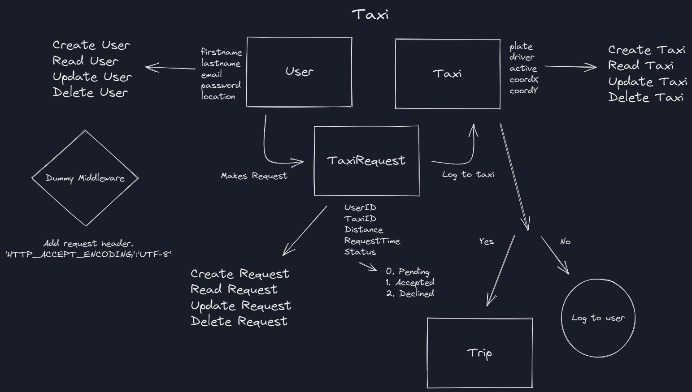

# Taxi API

This is an example of a Taxi calling API.

## Schema

  
## Features

* Includes User, Taxi and TaxiRequest models.
* Includes CRUD endpoints for these models.
* In the request of calling a taxi and in the case of acceptance or rejection of the taxi driver, celery sends an e-mail to the e-mail of the required person.
* Includes an dummy middleware. This middleware adds an attribute in the header.
* If the taxi driver accepts the request, the distance value calculated with geopy and the average speed value and the transportation time value calculated with the outgoing mail are also included.
